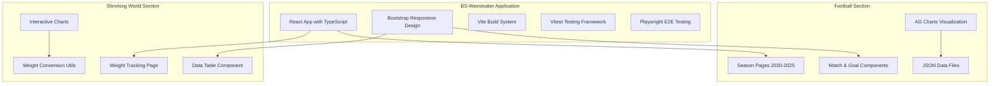

# BS-Weestoater Documentation

This documentation folder contains comprehensive guides for the major sections of the BS-Weestoater website. Each document provides detailed technical information, architectural diagrams, and implementation guidance.

## Documentation Structure

### 📚 Available Documentation

| Document                                                              | Description                                                                 | Last Updated |
| --------------------------------------------------------------------- | --------------------------------------------------------------------------- | ------------ |
| [Football Section Documentation](./football-section-documentation.md) | Complete guide to the football/soccer tracking system for Motherwell FC     | Current      |
| [Slimming World Documentation](./slimming-world-documentation.md)     | Comprehensive coverage of the weight tracking and data visualization system | Current      |
| [Garmin Activities Guide](./garmin-activities-guide.md)               | Manual methods for importing Garmin Connect activities                      | Current      |
| [Garmin Auto-Sync Guide](./GARMIN_AUTO_SYNC_GUIDE.md)                 | Automatic syncing of activities from Garmin Connect                         | Current      |
| [Garmin CMS Integration](./GARMIN_CMS_INTEGRATION.md)                 | Store activities in Supabase CMS database                                   | Current      |
| [Garmin CMS Quick Start](./GARMIN_CMS_QUICKSTART.md)                  | 5-minute setup for Supabase CMS integration                                 | Current      |

## Quick Navigation

### 🏈 Football Section

- **Purpose**: Track Motherwell FC match results, goal statistics, and season performance
- **Key Components**: Match details, goal scoring charts, season navigation
- **Technologies**: React, AG Charts, Bootstrap, TypeScript
- **Data Sources**: JSON files with match and goal data (2020-2025 seasons)

### ⚖️ Slimming World Section

- **Purpose**: Track weight loss progress with interactive charts and statistics
- **Key Components**: Weight data table, multi-series charts, unit conversion
- **Technologies**: React, AG Charts, custom weight conversion utilities
- **Data Sources**: JSON file with weight measurements and progress tracking

### 🏃 Garmin Activities

- **Purpose**: Track and display Garmin Connect fitness activities
- **Key Components**: Activity cards, statistics summaries, sync integration
- **Technologies**: React, Garmin Connect API, Supabase CMS
- **Data Sources**: Garmin Connect (via API) → JSON files or Supabase database
- **Guides**: Auto-sync from watch, CMS integration, manual import options

## Architecture Overview



## Common Patterns and Shared Architecture

### Data Flow Pattern

Both sections follow a consistent data flow architecture:

1. **JSON Data Import** → Static data files imported at build time
2. **TypeScript Interfaces** → Strong typing for data structures
3. **React Components** → Modular, reusable UI components
4. **AG Charts Integration** → Professional data visualization
5. **Bootstrap Responsive Design** → Mobile-first responsive layouts

### Component Structure

```text
Pages/ (Route-level components)
├── Components/ (Reusable UI components)
├── Config/ (Chart and configuration files)
├── Data/ (JSON data files)
├── Interfaces/ (TypeScript type definitions)
└── Utils/ (Shared utility functions)
```

### Testing Strategy

- **Unit Tests**: Vitest for component and utility testing
- **E2E Tests**: Playwright for integration testing
- **Type Safety**: TypeScript for compile-time error prevention

## Key Technologies

### Core Framework

- **React 18**: Modern React with hooks and concurrent features
- **TypeScript**: Type-safe JavaScript development
- **Vite 6**: Fast build tool and development server

### Data Visualization

- **AG Charts**: Professional charting library for interactive data visualization
- **AG Grid**: Advanced data grid functionality (football components)

### Styling and Layout

- **Bootstrap 5**: Responsive CSS framework
- **SCSS**: Enhanced CSS with variables and mixins
- **Custom Utilities**: Specialized styling for charts and components

### Development Tools

- **ESLint**: Code quality and consistency
- **Vitest**: Unit testing framework
- **Playwright**: End-to-end testing
- **GitHub Actions**: CI/CD pipeline

## Development Guidelines

### Code Organization

1. **Components** should be focused and single-responsibility
2. **Interfaces** should be defined in shared type files
3. **Utilities** should be pure functions with comprehensive tests
4. **Data files** should follow consistent JSON structure patterns

### Performance Best Practices

1. **Lazy Loading**: Route-level components use React.lazy()
2. **Memoization**: Expensive calculations are memoized
3. **Static Imports**: JSON data is imported statically for optimal bundling
4. **Responsive Design**: Mobile-first approach with performance considerations

### Testing Guidelines

1. **Unit Tests**: Test individual functions and components in isolation
2. **Integration Tests**: Test component interactions and data flow
3. **E2E Tests**: Test complete user workflows and navigation
4. **Type Tests**: Leverage TypeScript for compile-time validation

## Getting Started

### Prerequisites

- Node.js 20.x (specified in .nvmrc)
- Yarn 1.22.22 (package manager)
- Modern browser with ES2020+ support

### Development Setup

```bash
# Install dependencies
yarn install

# Start development server
yarn dev

# Run tests
yarn test

# Run E2E tests
yarn test:e2e

# Build for production
yarn build
```

### Adding New Documentation

1. Create new .md file in the docs/ folder
2. Follow the established structure and patterns
3. Include architecture diagrams using Mermaid
4. Add code examples and interface definitions
5. Update this README with navigation links

## Maintenance and Updates

### Regular Maintenance Tasks

- Update documentation when components change
- Refresh architecture diagrams for new features
- Review and update code examples
- Verify all links and references are current

### Documentation Standards

- Use Mermaid for architecture diagrams
- Include TypeScript interfaces and code examples
- Provide troubleshooting sections
- Maintain consistent formatting and structure

## Contributing

### Documentation Contributions

1. Follow the existing documentation patterns
2. Include practical examples and code snippets
3. Add architectural diagrams where helpful
4. Test all code examples before committing
5. Update navigation and cross-references

### Code Contributions

1. Refer to the relevant section documentation
2. Follow TypeScript and React best practices
3. Include comprehensive tests
4. Update documentation for any architectural changes

## Support and Resources

### Internal Resources

- [GitHub Actions Setup](../GITHUB_ACTIONS_SETUP.md)
- [Workflows Documentation](../.github/WORKFLOWS.md)
- [Project README](../README.md)

### External Resources

- [React Documentation](https://react.dev/)
- [TypeScript Handbook](https://www.typescriptlang.org/docs/)
- [AG Charts Documentation](https://charts.ag-grid.com/)
- [Bootstrap Documentation](https://getbootstrap.com/docs/5.3/)
- [Vite Documentation](https://vitejs.dev/)

---

**Last Updated**: December 2024  
**Maintained By**: BS-Weestoater Development Team  
**Documentation Version**: 1.0.0
