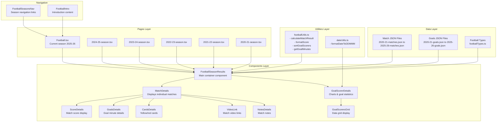
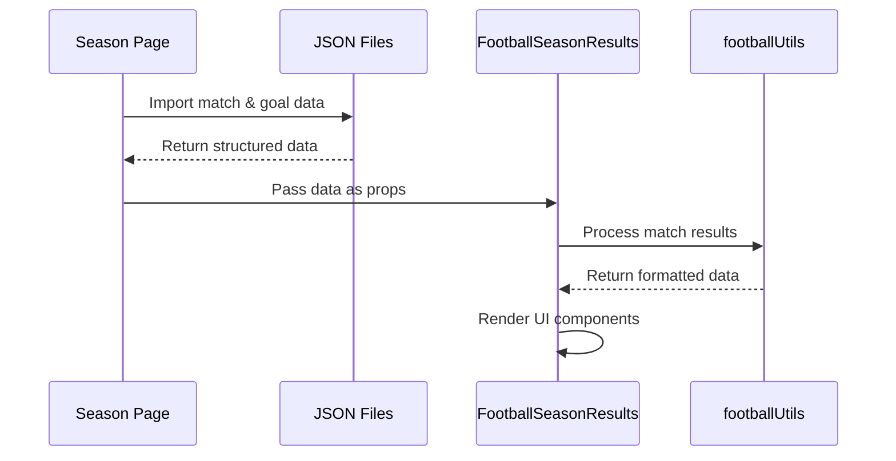

# Football Section Documentation

## Overview

The Football section of the BS-Weestoater website tracks Motherwell FC match results, goal statistics, and performance data across multiple seasons. This documentation provides a comprehensive guide to the architecture, components, and data flow.

## Architecture Diagram



## Core Components

### 1. FootballSeasonResults Component

**Location**: `src/components/football/footballSeasonResults.tsx`

**Purpose**: Main container component that orchestrates the display of match results and goal statistics.

**Key Features**:

- Receives season data (matches and goals) as props
- Renders in two-column layout (matches left, goals right)
- Handles null data gracefully with fallback messages
- Uses Bootstrap Grid system for responsive design

**Props Interface**:

```typescript
interface FootballSeasonResultsProps {
  season: string[]; // e.g., ["2023-2024"]
  matches?: Season[]; // Match data array
  goals?: GoalStats[]; // Goal statistics array
}
```

**Code Structure**:

```typescript
export const FootballSeasonResults = (props: any) => {
  const seasonsGoals = props.goals ? props.goals : null;
  const seasonsMatches = props.matches ? props.matches : null;
  const seasonsTitle = props.season
    ? props.season[0]
    : "Football Season Results";

  return (
    <div className="row mt-4">
      <div className="col-lg-6 col-sm-12 mb-4">
        {/* Match Details Column */}
        <MatchDetails details={seasonsMatches[0].details} />
      </div>
      <div className="col-lg-6 col-sm-12 mb-4">
        {/* Goal Statistics Column */}
        <GoalScorerDetails details={seasonsGoals[0].details} />
      </div>
    </div>
  );
};
```

### 2. MatchDetails Component

**Location**: `src/components/football/matchDetails.tsx`

**Purpose**: Displays individual match information in a structured table format.

**Key Features**:

- Maps through match details array
- Displays match venue, opposition, and score
- Includes sub-components for goals, cards, videos, and notes
- Applies CSS classes based on venue (home/away)

**Data Structure**:

```typescript
interface Match {
  date: string;
  opposition: string;
  venue: string; // "Home" or "Away"
  scored: number;
  conceded: number;
  league?: string; // e.g., "SPFL"
  video?: string; // YouTube URL
  goals?: MatchGoal[];
  cards?: MatchCard[];
  notes?: string;
}
```

### 3. GoalScorerDetails Component

**Location**: `src/components/football/goalScorerDetails.tsx`

**Purpose**: Creates interactive charts and grids showing goal-scoring statistics.

**Key Features**:

- Uses AG Charts for data visualization
- Displays bar chart for goals and line chart for assists
- Includes data grid via GoalScorersGrid component
- Responsive chart configuration

**Chart Configuration**:

```typescript
const _options: any = {
  data: details,
  title: {
    enabled: true,
    text: "No. of Goals & Assists",
  },
  series: [
    {
      type: "bar",
      xKey: "player",
      yKey: "goals",
      fill: "#fd9402",
      stroke: "#6a0117",
    },
    {
      type: "line",
      xKey: "player",
      yKey: "assists",
      strokeWidth: 0,
      marker: { enabled: true },
    },
  ],
};
```

## Utility Functions

### footballUtils.ts

**Location**: `src/utils/footballUtils.ts`

#### calculateMatchResult()

```typescript
export const calculateMatchResult = (
  scored: number,
  conceded: number
): "W" | "D" | "L" => {
  if (scored > conceded) return "W";
  if (scored < conceded) return "L";
  return "D";
};
```

**Purpose**: Determines match result (Win/Draw/Loss) based on goals scored vs conceded.

#### formatScore()

```typescript
export const formatScore = (
  scored: number,
  conceded: number,
  venue: string
): string => {
  return venue.toLowerCase() === "home"
    ? `${scored} - ${conceded}`
    : `${conceded} - ${scored}`;
};
```

**Purpose**: Formats score display based on venue (home scores first for home games).

#### sortGoalScorers()

```typescript
export const sortGoalScorers = (scorers: GoalScorer[]): GoalScorer[] => {
  return [...scorers].sort((a, b) => {
    if (a.goals !== b.goals) return b.goals - a.goals;
    if (a.assists !== b.assists) return b.assists - a.assists;
    return a.player.localeCompare(b.player);
  });
};
```

**Purpose**: Sorts goal scorers by goals (descending), then assists (descending), then alphabetically by name.

#### getGoalMinutes()

```typescript
export const getGoalMinutes = (goals: MatchGoal[]): string => {
  return goals
    .map((goal) => goal.mins.toString())
    .sort((a, b) => parseInt(a) - parseInt(b))
    .join(", ");
};
```

**Purpose**: Formats goal minutes as comma-separated string in chronological order.

## Data Flow Architecture

### 1. Data Loading Process



### 2. Component Hierarchy

```
FootballSeasonResults
├── MatchDetails
│   ├── ScoreDetails
│   ├── GoalsDetails
│   ├── CardsDetails
│   ├── VideoLink
│   └── NotesDetails
└── GoalScorerDetails
    └── GoalScorersGrid
```

### 3. Data Structure Flow

**JSON Files** → **TypeScript Interfaces** → **React Components** → **Rendered UI**

## TypeScript Interfaces

### Core Interfaces

```typescript
// Individual goal scorer statistics
export interface GoalScorer {
  player: string;
  goals: number;
  assists: number;
}

// Individual match goal details
export interface MatchGoal {
  player: string;
  mins: number; // Minute goal was scored
  assist?: string; // Optional assist provider
}

// Card information (yellow/red)
export interface MatchCard {
  player: string;
  type: "yellow" | "red";
  minute: number;
}

// Complete match information
export interface Match {
  date: string; // "DD/MM/YY" format
  opposition: string; // Opponent team name
  venue: string; // "Home" or "Away"
  scored: number; // Goals scored by Motherwell
  conceded: number; // Goals conceded
  league?: string; // Competition (e.g., "SPFL")
  video?: string; // YouTube URL
  goals?: MatchGoal[]; // Goal details
  cards?: MatchCard[]; // Card details
  notes?: string; // Match notes
}

// Season container
export interface Season {
  startDate: string; // Season start date
  details: Match[]; // Array of matches
}

// Goal statistics container
export interface GoalStats {
  season: string; // Season identifier
  details: GoalScorer[]; // Array of goal scorers
}
```

## Testing Strategy

### Unit Tests

**Location**: `src/__tests__/utils/footballUtils.test.tsx`

Tests cover all utility functions with various scenarios:

- Match result calculations (W/D/L)
- Score formatting for home/away games
- Goal scorer sorting algorithms
- Goal minute formatting

**Example Test**:

```typescript
describe("calculateMatchResult", () => {
  it("returns W when scored more than conceded", () => {
    expect(calculateMatchResult(3, 1)).toBe("W");
    expect(calculateMatchResult(2, 0)).toBe("W");
  });

  it("returns L when scored less than conceded", () => {
    expect(calculateMatchResult(1, 3)).toBe("L");
    expect(calculateMatchResult(0, 2)).toBe("L");
  });

  it("returns D when scored equals conceded", () => {
    expect(calculateMatchResult(1, 1)).toBe("D");
    expect(calculateMatchResult(0, 0)).toBe("D");
  });
});
```

### E2E Tests

**Location**: `e2e-tests/components-speccy.ts`

End-to-end tests verify:

- Season navigation functionality
- Data visualization rendering
- Component integration

## File Structure

```
src/
├── components/football/
│   ├── footballSeasonResults.tsx    # Main container
│   ├── matchDetails.tsx             # Match listings
│   ├── goalScorerDetails.tsx        # Goal statistics & charts
│   ├── scoreDetails.tsx             # Score display
│   ├── goalsDetails.tsx             # Goal minute details
│   ├── cardsDetails.tsx             # Card information
│   ├── videoLinkDetails.tsx         # Video links
│   ├── notesDetails.tsx             # Match notes
│   └── goalScorersGrid.tsx          # Data grid
├── content/football/
│   ├── footballIntro.tsx            # Introduction content
│   └── footballSeasonsNav.tsx       # Navigation component
├── pages/
│   ├── Football.tsx                 # Current season (2025-26)
│   ├── 2024-25-season.tsx          # Historical seasons
│   ├── 2023-24-season.tsx
│   ├── 2022-23-season.tsx
│   ├── 2021-22-season.tsx
│   └── 2020-21-season.tsx
├── data/
│   ├── 2025-26-matches.json        # Match data files
│   ├── 2025-26-goals.json          # Goal data files
│   └── ... (other seasons)
├── interfaces/
│   └── footballTypes.ts            # TypeScript interfaces
└── utils/
    └── footballUtils.ts             # Utility functions
```

## Styling and CSS

### SCSS Structure

**Location**: `src/scss/utils/_football.scss`

Key styling features:

- Responsive match details cards
- Color-coded venue indicators (home/away)
- Card styling for yellow/red cards
- Chart container styling

### CSS Classes

- `.match-details.home` - Home match styling
- `.match-details.away` - Away match styling
- `.cards.yellow` - Yellow card indicator
- `.cards.red` - Red card indicator
- `.no-bullets` - Remove list bullets

## Performance Considerations

### Lazy Loading

All season pages use React's `lazy()` for code splitting:

```typescript
const FootballSeason202324 = lazy(() =>
  import("./pages/2023-24-season").then((module) => ({
    default: module.FootballSeason202324,
  }))
);
```

### Data Processing

- Goal scorer sorting is memoized to prevent unnecessary re-renders
- Chart options are computed once per data change
- JSON data is statically imported for optimal bundling

## Future Enhancement Opportunities

1. **Real-time Data Integration**: Connect to live football APIs
2. **Advanced Analytics**: Add more statistical analysis (xG, possession, etc.)
3. **Interactive Features**: Click-through match details, player profiles
4. **Data Visualization**: Enhanced charts with drill-down capabilities
5. **Mobile Optimization**: Improved responsive design for mobile devices
6. **Search and Filter**: Add search functionality for specific matches/players
7. **Export Features**: Allow data export to CSV/PDF formats

## Dependencies

### External Libraries

- **ag-charts-react**: Data visualization and charting
- **ag-grid-react**: Data grid functionality
- **react-router-dom**: Navigation between seasons
- **bootstrap**: Responsive CSS framework

### Internal Dependencies

- Custom utility functions in `footballUtils.ts`
- Shared TypeScript interfaces
- Global SCSS styling framework

## Troubleshooting

### Common Issues

1. **Chart Not Rendering**: Check AG Charts import and data format
2. **Navigation Broken**: Verify React Router setup and route paths
3. **Data Not Loading**: Confirm JSON file imports and data structure
4. **Styling Issues**: Check Bootstrap classes and custom SCSS compilation

### Debug Tips

- Use React DevTools to inspect component props
- Verify data structure matches TypeScript interfaces
- Check browser console for JavaScript errors
- Test with mock data for component isolation
