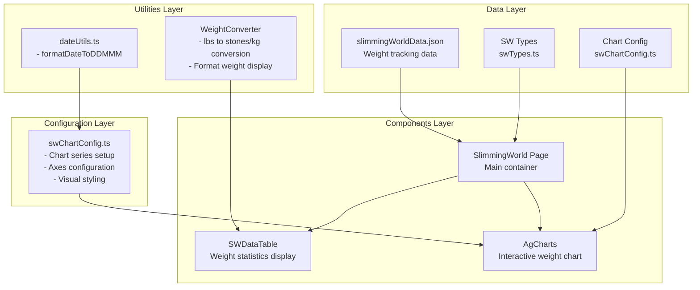
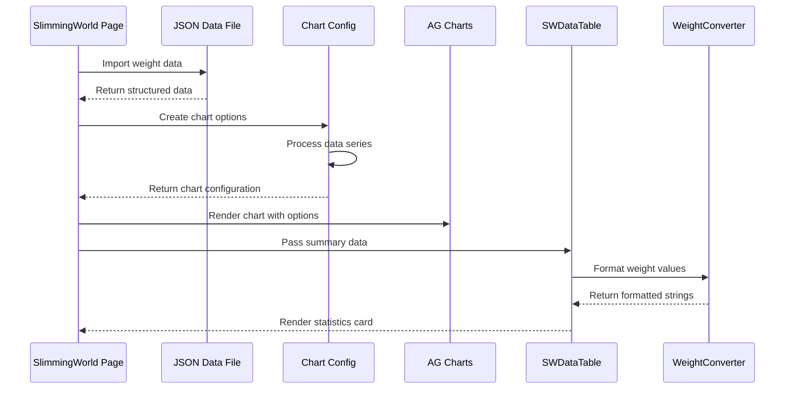

# Slimming World (SW) Section Documentation

## Overview

The Slimming World section tracks weight loss progress, weight measurements, and goal achievements through interactive data visualization and comprehensive data management. This documentation provides detailed coverage of the architecture, components, and data processing workflows.

## Architecture Diagram



## Core Components

### 1. SlimmingWorld Page Component

**Location**: `src/pages/SlimmingWorld.tsx`

**Purpose**: Main page component that orchestrates the entire Slimming World section display.

**Key Features**:

- Imports and processes JSON weight data
- Creates chart configuration options
- Renders responsive Bootstrap grid layout
- Handles data table and chart visualization

**Code Structure**:

```typescript
export const SlimmingWorld = () => {
  const _options = createSwChartOptions(swData[0].data);

  return (
    <>
      <PageTitleH1 title="Slimming World" />
      <div className="row">
        <div className="col-xxl-3 col-xl-3 col-lg-4 col-md-6 col-sm-6 col-xs-12 mb-4">
          <SWDataTable
            startDate={swData[0].startDate}
            startWeight={swData[0].startWeight}
            targetWeight={swData[0].targetWeight}
            data={swData[0].data}
          />
        </div>
        <div className="col-lg-8 col-md-6 col-sm-6 col-xs-12 mb-4">
          <div className="sw-chart">
            <AgCharts options={_options} />
          </div>
        </div>
      </div>
    </>
  );
};
```

### 2. SWDataTable Component

**Location**: `src/components/sw/swDataTable.tsx`

**Purpose**: Displays summary statistics and key metrics in a card format.

**Key Features**:

- Shows join date, start weight, and target weight
- Calculates and displays current weight and total weight lost
- Uses WeightConverter for consistent weight formatting
- Handles empty data states gracefully

**Props Interface**:

```typescript
interface SWDataTableProps {
  startDate: string; // Program start date
  startWeight: number; // Initial weight in lbs
  targetWeight: number; // Goal weight in lbs
  data: SwDataPoint[]; // Array of weight measurements
}
```

**Data Processing Logic**:

```typescript
// Sort data to find most recent entry
const mostRecent = [...data].sort(
  (a, b) =>
    parseDateString(b.date).getTime() - parseDateString(a.date).getTime()
)[0];

// Calculate total weight lost
const totalLost = startWeight - mostRecent.weight;
```

### 3. WeightConverter Component

**Location**: `src/components/sw/WeightConverter.tsx`

**Purpose**: Converts and formats weight measurements between different units.

**Key Features**:

- Converts between pounds (lbs) and kilograms (kgs)
- Formats output as stones, pounds, and kilograms
- Handles both lbs-to-kg and kg-to-lbs conversions
- Provides error handling for invalid inputs

**Conversion Logic**:

```typescript
export const WeightConverter = (props: any) => {
  const { lbs, kgs } = props;

  // Convert kgs to lbs if only kgs is provided
  const weightInLbs = kgs ? kgs * 2.20462 : lbs;

  // Calculate stones and remaining lbs
  const stones = Math.floor(weightInLbs / 14);
  const remainingLbs = (weightInLbs % 14).toFixed(1);
  const weightInKgs = (weightInLbs * 0.45359237).toFixed(2);

  // Format: "12 st 12.0 lbs (180.0 lbs) | 81.65 kgs"
  const result = `${stones} st ${remainingLbs} lbs (${roundedLbs} lbs) | ${weightInKgs} kgs`;

  return <span>{result}</span>;
};
```

## Chart Configuration System

### swChartConfig.ts

**Location**: `src/config/swChartConfig.ts`

**Purpose**: Creates comprehensive AG Charts configuration for weight visualization.

**Key Features**:

- Multi-series chart with weight, loss, target, and achievements
- Custom date formatting and axis configuration
- Responsive design with mobile considerations
- Visual styling with branded colors

**Chart Series Configuration**:

```typescript
export const createSwChartOptions = (
  data: SwDataPoint[]
): AgCartesianChartOptions<SwDataPoint> => ({
  height: 400,
  data: data,
  title: {
    text: "Slimming World",
    enabled: true,
  },
  series: [
    {
      // Weight line chart
      type: "line",
      xKey: "date",
      yKey: "weight",
      yName: "Weight in lbs",
      stroke: "blue",
      strokeWidth: 3,
      marker: {
        enabled: true,
        shape: "diamond",
        size: 12,
        fill: "blue",
      },
    },
    {
      // Weight lost bar chart
      type: "bar",
      xKey: "date",
      yKey: "lost",
      yName: "Weight lost in lbs",
      fill: "#ff9900",
    },
    {
      // Target line
      type: "line",
      xKey: "date",
      yKey: "target",
      yName: "Target",
      stroke: "green",
      strokeWidth: 1,
    },
    {
      // Slimmer of the Week achievements
      type: "line",
      xKey: "date",
      yKey: "sotw",
      yName: "Slimmer of the Week",
      stroke: "#6a0117",
      strokeWidth: 3,
      marker: {
        enabled: true,
        shape: "star",
        size: 15,
        fill: "#6a0117",
      },
    },
  ],
  // ... axes and formatting configuration
});
```

**Axes Configuration**:

```typescript
axes: [
  {
    type: "category",
    position: "bottom",
    title: { text: "Date of Weigh-in" },
    label: {
      rotation: 45,
      formatter: (params: { value: string }) => formatDateToDDMMM(params.value),
    },
  },
  {
    type: "number",
    position: "left",
    title: { text: "Weight in lbs" },
  },
  {
    type: "number",
    position: "right",
    title: { text: "Weight lost in lbs" },
  },
];
```

## Data Structure and Interfaces

### TypeScript Interfaces

**Location**: `src/interfaces/swTypes.ts`

```typescript
// Individual weight measurement point
export interface SwDataPoint {
  date: string; // "DD/MM/YYYY" format
  weight: number; // Weight in pounds
  lost: number; // Cumulative weight lost
  target: number; // Target weight
  sotw?: number; // Slimmer of the Week flag
}

// Complete SW data structure
export interface SwData {
  startDate: string; // Program start date
  startWeight: number; // Initial weight
  targetWeight: number; // Goal weight
  data: SwDataPoint[]; // Array of measurements
}
```

### Data File Structure

**Location**: `src/data/slimmingWorldData.json`

```json
[
  {
    "startDate": "10/06/2025",
    "startWeight": 282.5,
    "targetWeight": 196,
    "data": [
      {
        "date": "10/06/2025",
        "weight": 282.5,
        "change": 0,
        "lost": 0,
        "target": 196
      },
      {
        "date": "17/06/2025",
        "weight": 277.5,
        "change": -5,
        "lost": 5,
        "target": 196
      },
      {
        "date": "15/07/2025",
        "weight": 268.5,
        "change": -3,
        "lost": 14,
        "target": 196,
        "sotw": 100
      }
      // ... additional entries
    ]
  }
]
```

## Data Flow Architecture

### 1. Data Processing Pipeline



### 2. Component Data Flow

```text
slimmingWorldData.json
       ↓
SlimmingWorld Page
       ↓
   ┌────────────────┬─────────────────┐
   ↓                ↓                 ↓
SWDataTable    swChartConfig    AgCharts
   ↓                ↓                 ↓
WeightConverter  formatDateToDDMMM   Rendered Chart
   ↓                ↓                 ↓
Formatted Text   Formatted Dates   Interactive UI
```

## Utility Functions

### dateUtils.ts

**Location**: `src/utils/dateUtils.ts`

#### formatDateToDDMMM()

```typescript
export function formatDateToDDMMM(dateString: string) {
  // Split the input string into day, month, year
  const [day, month, year] = dateString.split("/").map(Number);

  // Create a date object (months are 0-indexed in JavaScript)
  const date = new Date(year, month - 1, day);

  // Format the date as "dd MMM"
  return date.toLocaleDateString("en-GB", {
    day: "2-digit",
    month: "short",
  });
}
```

**Purpose**: Converts date strings from "DD/MM/YYYY" format to "DD MMM" format for chart display.

**Usage**: Primary used in chart axis label formatting for improved readability.

## Testing Strategy

### Unit Tests

**Location**: `src/__tests__/components/sw/`

#### WeightConverter Tests

```typescript
describe("WeightConverter", () => {
  it("converts pounds to stones, pounds, and kilograms", () => {
    render(<WeightConverter lbs={180} />);
    expect(
      screen.getByText("12 st 12.0 lbs (180.0 lbs) | 81.65 kgs")
    ).toBeInTheDocument();
  });

  it("converts kilograms to stones, pounds, and total pounds", () => {
    render(<WeightConverter kgs={100} />);
    expect(
      screen.getByText("15 st 10.5 lbs (220.5 lbs) | 100.00 kgs")
    ).toBeInTheDocument();
  });

  it("handles decimal values correctly", () => {
    render(<WeightConverter lbs={156.7} />);
    expect(
      screen.getByText("11 st 2.7 lbs (156.7 lbs) | 71.08 kgs")
    ).toBeInTheDocument();
  });
});
```

#### SWDataTable Tests

```typescript
describe("SWDataTable", () => {
  const mockData = [
    { date: "01/10/2023", weight: 180 },
    { date: "08/10/2023", weight: 178 },
    { date: "15/10/2023", weight: 175 },
  ];

  const defaultProps = {
    data: mockData,
    startWeight: 190,
    startDate: "01/01/2023",
    targetWeight: 170,
  };

  it("renders no data message when data is empty", () => {
    render(<SWDataTable {...defaultProps} data={[]} />);
    expect(screen.getByText("No data available")).toBeInTheDocument();
  });

  it("displays join date", () => {
    render(<SWDataTable {...defaultProps} />);
    expect(screen.getByText("Joined:")).toBeInTheDocument();
    expect(screen.getByText("01/01/2023")).toBeInTheDocument();
  });
});
```

#### Chart Configuration Tests

```typescript
describe("Slimming World Chart Configuration", () => {
  const mockData: SwDataPoint[] = [
    {
      date: "01/01/2025",
      weight: 200,
      lost: 2,
      target: 180,
      sotw: 2,
    },
  ];

  const config = createSwChartOptions(mockData);

  test("chart has correct base configuration", () => {
    expect(config.width).toBe(800);
    expect(config.height).toBe(400);
    expect(config.data).toBe(mockData);
  });

  test("weight series has correct configuration", () => {
    const series = config.series || [];
    expect(series[0]).toMatchObject({
      type: "line",
      xKey: "date",
      yKey: "weight",
      yName: "Weight in lbs",
      stroke: "blue",
      strokeWidth: 3,
    });
  });

  test("axes are properly configured", () => {
    const axes = config.axes || [];
    expect(axes).toHaveLength(3); // category and 2 number axes

    expect(axes[0]).toMatchObject({
      type: "category",
      position: "bottom",
      title: { text: "Date of Weigh-in" },
    });
  });
});
```

### E2E Tests

**Location**: `e2e-tests/components-speccy.ts`

```typescript
test("slimming world data visualization", async ({ page }) => {
  await page.goto("/slimmingWorld");
  await expect(page.getByTestId("sw-data-table")).toBeVisible();
  await expect(page.getByTestId("ag-charts")).toBeVisible();
});
```

## File Structure

```text
src/
├── components/sw/
│   ├── swDataTable.tsx              # Weight statistics display
│   └── WeightConverter.tsx          # Weight unit conversion
├── pages/
│   └── SlimmingWorld.tsx            # Main SW page
├── config/
│   └── swChartConfig.ts             # Chart configuration
├── data/
│   └── slimmingWorldData.json       # Weight tracking data
├── interfaces/
│   └── swTypes.ts                   # TypeScript interfaces
└── utils/
    └── dateUtils.ts                 # Date formatting utilities
```

## Styling and CSS

### SCSS Structure

**Location**: `src/scss/style.scss`

```scss
/*--    Slimming World chart */
.sw-chart {
  width: 100%;
  height: 500px;
  padding: 1rem 0;
  margin-bottom: 2rem;
  border: 1px solid $grey500;
  box-shadow: 0 0 0.333rem $grey500;
  background-color: transparent;

  .ag-charts-wrapper {
    height: 450px !important;
  }

  @media (max-width: 991px) {
    height: 400px;

    .ag-charts-wrapper {
      height: 350px !important;
    }
  }
}
```

### Responsive Design Features

- Bootstrap grid system for adaptive layouts
- Mobile-optimized chart heights
- Flexible card components for different screen sizes
- Touch-friendly chart interactions

## Performance Considerations

### Data Optimization

- **Static JSON Import**: Data is bundled at build time for optimal loading
- **Memoized Calculations**: Weight calculations are performed once per render
- **Sorted Data Processing**: Most recent weight is calculated efficiently using sort

### Chart Performance

- **AG Charts Community**: Lightweight charting library
- **Responsive Configuration**: Charts adapt to container size automatically
- **Lazy Chart Loading**: Chart components load only when needed

### Component Optimization

```typescript
// Efficient data sorting for most recent entry
const mostRecent = [...data].sort(
  (a, b) =>
    parseDateString(b.date).getTime() - parseDateString(a.date).getTime()
)[0];
```

## Data Analysis Features

### Statistical Calculations

1. **Total Weight Lost**: `startWeight - currentWeight`
2. **Progress Percentage**: `(totalLost / (startWeight - targetWeight)) * 100`
3. **Average Weekly Loss**: `totalLost / numberOfWeeks`
4. **Achievements Tracking**: SOTW (Slimmer of the Week) markers

### Visualization Features

1. **Multi-Series Charts**: Weight, loss, target, and achievements
2. **Interactive Markers**: Different shapes for different data types
3. **Dual Y-Axes**: Weight values and loss amounts on separate scales
4. **Date Formatting**: Human-readable date labels on X-axis

## Future Enhancement Opportunities

1. **Goal Setting**: Add intermediate milestone tracking
2. **Trend Analysis**: Calculate and display weight loss trends
3. **Comparative Analytics**: Compare different time periods
4. **Export Features**: PDF reports and CSV data export
5. **Social Features**: Share achievements and progress
6. **Mobile App**: PWA or native mobile application
7. **Data Import**: Upload data from other tracking apps
8. **Predictive Modeling**: Estimate timeline to reach goals

## Dependencies

### External Libraries

- **ag-charts-react**: Professional charting solution
- **react**: Core React framework
- **bootstrap**: Responsive CSS framework

### Internal Dependencies

- Custom date formatting utilities
- Shared TypeScript interfaces
- Global SCSS styling system

## Troubleshooting

### Common Issues

1. **Chart Not Rendering**:

   - Verify AG Charts import and version compatibility
   - Check data format matches SwDataPoint interface
   - Ensure container has defined height

2. **Weight Conversion Errors**:

   - Verify input values are numeric
   - Check for null/undefined values in props
   - Validate conversion constants are accurate

3. **Data Loading Issues**:

   - Confirm JSON file structure matches interface
   - Check import statements and file paths
   - Validate date format consistency

4. **Responsive Layout Problems**:
   - Verify Bootstrap grid classes
   - Check CSS media queries
   - Test on different screen sizes

### Debug Tips

- Use React DevTools to inspect component props and state
- Check browser console for AG Charts warnings
- Validate data structure using TypeScript compiler
- Test component in isolation with mock data
- Use network tab to verify JSON loading
